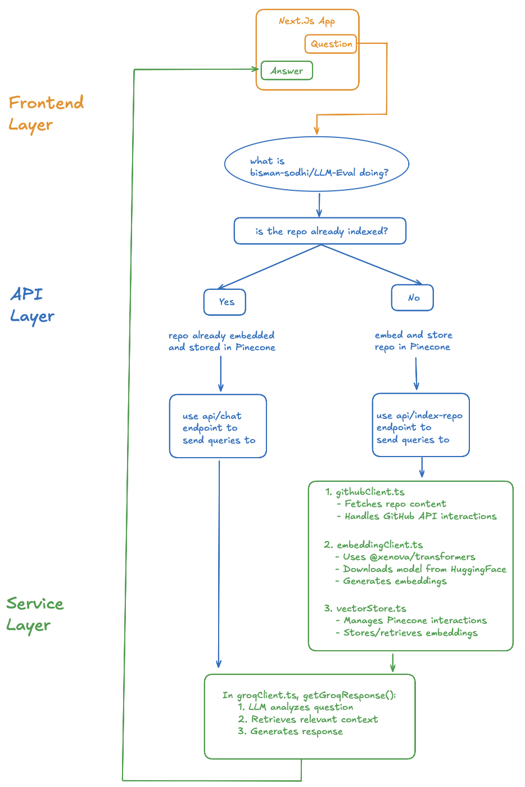

# GitHub Repository Answer Engine

A powerful AI-powered chat application for exploring and understanding GitHub repositories. This tool allows users to ask questions about any GitHub repository and receive detailed, context-aware answers based on the repository's code and documentation.


## Demo

Check out the demo video to see the GitHub Repository Answer Engine in action:

[](https://youtu.be/PeuAYAhO8GE?si=_liM3ZgmlNcHFcNu)

## Try It Now

**Live Demo**: [GitLore - GitHub Answer Engine](https://github-answer-engine-n9gs.vercel.app)

## Architecture Design



## Features

- **Repository Indexing**: Automatically indexes GitHub repositories to understand their structure and content
- **Semantic Search**: Uses vector embeddings to find the most relevant files and code snippets
- **Smart Context Selection**: Prioritizes relevant files based on the query's intent
- **File-Aware Responses**: Specialized handling for queries about specific files or code structures
- **Context Persistence**: Maintains conversation history for better follow-up questions
- **Dynamic Model Loading**: Automatically downloads and caches embedding models from HuggingFace
- **Advanced LLM Integration**: Uses Groq's Llama-3.3-70b-versatile model for high-quality responses
- **Serverless-Compatible**: Optimized for deployment in serverless environments like Vercel

## Architecture

The application is structured in three main layers:

### Frontend Layer
- Next.js App with a clean, minimalist interface
- Chat-based user experience with question input and answer display
- Responsive design for both desktop and mobile usage

### API Layer
- API routes for handling chat interactions
- Repository indexing endpoint that processes GitHub repositories
- Smart detection of whether a repository needs indexing

### Service Layer
- **GitHub Integration**: `githubClient.ts` fetches repository content via GitHub's API
- **Embedding Generation**: `embeddingClient.ts` uses the `@xenova/transformers` library to dynamically load models from HuggingFace and generate embeddings
- **Vector Storage**: `vectorStore.ts` handles storage and retrieval of embeddings in Pinecone
- **LLM Processing**: `groqClient.ts` manages communication with Groq's LLM API for answer generation

## How It Works

1. **Repository Indexing**:
   - When a user mentions a GitHub repository, the system checks if it's already indexed
   - If not indexed, it automatically fetches the repository structure via GitHub API
   - Files are processed to generate embeddings using the `Xenova/all-mpnet-base-v2` model
   - Embeddings and metadata are stored in Pinecone for efficient retrieval

2. **Question Answering**:
   - User queries are analyzed to determine intent and identify potential file references
   - The system performs semantic search against the repository's embeddings
   - Relevant files are intelligently ranked and selected as context
   - A prompt is constructed with the selected context and sent to the Groq LLM
   - The LLM generates a detailed response based on the provided context

## Environment Setup

Create a `.env` file in the root directory with the following variables:

```bash
# Pinecone - for vector storage
PINECONE_API_KEY=your_pinecone_api_key

# GitHub - for repository access
GITHUB_TOKEN=your_github_personal_access_token

# Groq - for LLM access
GROQ_API_KEY=your_groq_api_key
```

## Deployment Instructions

### Prerequisites

- Node.js 18.x or higher
- npm or yarn
- GitHub Personal Access Token
- Pinecone API Key (Free tier works for testing)
- Groq API Key

### Local Development

1. Clone the repository:
   ```bash
   git clone https://github.com/bisman-sodhi/github-answer-engine.git
   cd github-answer-engine
   ```

2. Install dependencies:
   ```bash
   npm install
   # or
   yarn install
   ```

3. Set up your environment variables by creating a `.env` file (see Environment Setup above)

4. Run the development server:
   ```bash
   npm run dev
   # or
   yarn dev
   ```

5. Open [http://localhost:3000](http://localhost:3000) to see the application

### Production Deployment on Vercel

1. Push your code to a GitHub repository
   - **Important**: Make sure to add `/public/models/` to your `.gitignore` file to prevent large model files from being committed
   - The application will download the model files at runtime when needed

2. Visit [Vercel](https://vercel.com/new) and import your GitHub repository

3. Add the environment variables in the Vercel project settings:
   - `PINECONE_API_KEY`
   - `GITHUB_TOKEN`
   - `GROQ_API_KEY`

4. Configure Vercel Function Settings (optional but recommended):
   - Increase the Function Execution Timeout to at least 60 seconds
   - Increase the Maximum Function Size to accommodate model loading

5. Deploy with the default settings

6. **Note about first-time usage**: The first query for a repository might take longer as it needs to:
   1. Index the repository if it's not already indexed
   2. Download the embedding model from HuggingFace if it's not cached
   
   Subsequent queries will be much faster as both the repository data and model will be cached.

## Usage

1. Visit the application in your browser
2. Enter a GitHub repository in the format `owner/repo` (e.g., "facebook/react")
3. Ask specific questions about the repository such as:
   - "What is the purpose of this repository?"
   - "How is the code structured?"
   - "What does page.tsx do?"
   - "Show me the main entry point"

The system will automatically index the repository (if needed) and provide detailed answers based on the actual code.

## Technical Details

### Embedding Model
The application uses the `Xenova/all-mpnet-base-v2` model from HuggingFace for generating embeddings. This model:
- Is dynamically downloaded at runtime through the `@xenova/transformers` library
- Does not need to be included in the repository, reducing Git repository size
- Gets cached in the server environment after the first use
- Works seamlessly in both local and serverless environments

### Vector Storage
Pinecone is used for storing and retrieving vectors. The application:
- Creates a namespace for each repository (format: `owner/repo`)
- Stores file content, metadata, and embeddings for each document
- Handles metadata size limits automatically
- Optimizes query results based on relevance and file importance

### LLM Integration
The application uses Groq's Llama-3.3-70b-versatile model for answer generation:
- Creates context-aware prompts with relevant repository information
- Handles conversation history for better follow-up questions
- Optimizes token usage to stay within API limits
- Provides detailed, code-aware answers with proper formatting

## License

MIT

---

This project was built with [Next.js](https://nextjs.org/) and bootstrapped with [`create-next-app`](https://nextjs.org/docs/app/api-reference/cli/create-next-app).

## Getting Started

First, run the development server:

```bash
npm run dev
# or
yarn dev
# or
pnpm dev
# or
bun dev
```

Open [http://localhost:3000](http://localhost:3000) with your browser to see the result.

You can start editing the page by modifying `app/page.tsx`. The page auto-updates as you edit the file.

This project uses [`next/font`](https://nextjs.org/docs/app/building-your-application/optimizing/fonts) to automatically optimize and load [Geist](https://vercel.com/font), a new font family for Vercel.

## Learn More

To learn more about Next.js, take a look at the following resources:

- [Next.js Documentation](https://nextjs.org/docs) - learn about Next.js features and API.
- [Learn Next.js](https://nextjs.org/learn) - an interactive Next.js tutorial.

You can check out [the Next.js GitHub repository](https://github.com/vercel/next.js) - your feedback and contributions are welcome!

## Deploy on Vercel

The easiest way to deploy your Next.js app is to use the [Vercel Platform](https://vercel.com/new?utm_medium=default-template&filter=next.js&utm_source=create-next-app&utm_campaign=create-next-app-readme) from the creators of Next.js.

Check out our [Next.js deployment documentation](https://nextjs.org/docs/app/building-your-application/deploying) for more details.
